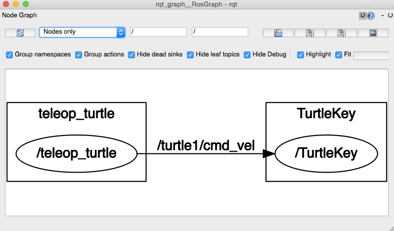
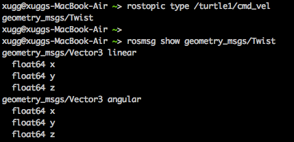
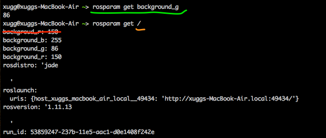

# Core ROS Tutorials
#0. References
* [ros.org](www.ros.org)   
* [ros answers](http://answers.ros.org/questions/)

#1. Navigating the Filesystem

##1.2 Filesystme concepts

* **package:** Packages areg the software organization unit of ROS code. Each package can contain libraries, executables, scripts, or other artifacts.
* **Manifest(package.xml)** A manifest is a description of a package.Its servers dependencies, version, maintainer, license, etc...

##1.3 Filesystem Tools

###1.3.1 rospack

```  
$ rospack find [package_name]
```    

An example:   


###1.3.2 roscd

```
$ roscd [locationname[/subdir]]    
```

An example:     
 


The settings in profile:   


Note that roscd, like other ROS tools, will *only* find ROS apckages that within the directories listed in you **ROS_PACKAGE_PATH**.  
 
  

###1.3.3 roscd log

roscd log will take you to the folder where ROS stores log files.


###1.3.4 rosls

```
$ rosls [locationname[/subdir]]
```

An example:

  

###1.3.5 tap completion

# 2. Creating a ROS Package

##2.1 What makes up a catkin Package?

* *package.xml:* (catkin compliant package.xml) provides meta information about the package.
* *CMakeLists.txt:* a boilerplate.
* There can be no more than one package in each folder.

##2.2 Packages in a catkin Workspace

```
workspace_folder/
	src/
		CMakeLists.txt  --'Topleve' CMake file, provided by catkin
		package1/
			CMakeLists.txt
			package.xml
		...
		packagen/
			CMakeLists.txt
			package.xml
```

##2.3 Creating a catkin Package

1. Change to src directory    

```
cd ~/ros_workspace/src
```

2. Use the *catkin_create_pkg* script to create a new package called 'beginner_tutorials' which depends on std_msgs, roscpp, and rospy.

```
$ catkin_create_pkg <package_name> [depend1] [depend2] [depend3]
```


##2.4 Building a catkin workspace and sourcing the setup file

1 Cahnge to ws directory && *catkin_make*  


```   
cd ~/ros_worksapce
catkin_make    
```  


 
2 *devel*


##2.5 package dependencies

###2.5.1 First-order dependencies


These dependencies for a package are stored in the **package.xml file: 


###2.5.2 Idirect dependencies


##2.6 Customizing Your Package

###2.6.1 Customizing the package.xml

####2.6.1.1 description tag

```
<sescription>The beginner_tutorials package</descrition>
```
  
####2.6.1.2 maintainer tags

```
<maintainer email="xugg@todo.todo">xugg</maintainer>

```

####2.6.1.3 license tags

```
<license>BSD</license>
```

####2.6.1.4 dependencies tags

* build_depend
* buildtool_depend
* run_depend
* test_depend


#3 Building a ROS Package


##3.1 Building Packages


###3.1.1 Using *catkin_make*


*catkin_make* = *cmake* + *make*


```
$ catkin_make [make_targets] [-DCMAK_VARIABLES=...]
```

A standard CMake workflow:

```
$ mkdir build
$ cd build
$ cmake ..
$ make
$ make install # (optionally)
```

Catkin workflow:


```
$ catkin_make [--source my_src]
$ catkin_make install [--source my_src] (optionally)
```

###3.1.2 Building your package

* build: is where *cmake* and *make* are called to configure and build your packages.
* devel: is where your executables and libraries go .

#4 Understanding ROS Nodes


##4.1 Quick overview of Graph concepts

* Nodes: A ndoe is an executable that uses ROS to communicate with other nodes.
* Messages: ROS data type used when subscribing or publishing to a topic.
* Topics: Nodes can *publish* messages to a topic as well as *subscribe* to a topic to receive messages.
* Master: Name service for ROS(i.e. helps nodes find each other)
* rosout: ROS equivalent of stdout/stderr
* roscore: Master + rosout + parameter server

##4.2 Nodes

* executable file within a ROS package. 
* using a ROS client library to communicate with other nodes.
* can publish or subscribe to a Topic.
* can provide or use a Service.

##4.3 Client Libraries

ROS client libraries allow nodes written in different programming languages to communicate:

* rospy = python client library
* roscpp = c++ client library

##4.4 roscore


##4.5 Using rosnode


##4.6 Using rosrun

*rosrun* allows you to use the package name to directly run a node within a package.

```
$ rosrun [package_name] [node_name]
```

An example, run the turtlesim_node in the turtlesim package.


```
$ rosrun turtlesim turtlesim_node
```


##4.7 Review

* roscore = ros + core: master(provides name service for ROS) + rosout(stdout/stderr) + parameter server.
* rosnode = ros + node: ROS tool to get information about a node.
* rosrun = ros + run: runs a node from a given package.

# 5 Understanding ROS Topics

## 5.1 turtle keyboard teleoperation


## 5.2 ROS topics

* The *turtlesim_node* and *turtle_teleop_key* node are communicating with each other over a ROS **Topic**.

* *turtlesim_teleop_key* is **publishing** the key strokes on a topic, while *turtlesim* **subscribes** to the same topic to receive the key strokes.

###5.2.1 Using rqt_graph

* *rqt_graph* creates a dynamic graph of what's going on in the system.
* *rqt_graph* is part of the *rqt* package.

install *rqt*:

*  rqtgraph error1:


```
pip uninstall pyparsing
pip install -Iv https://pypi.python.org/packages/source/p/pyparsing/pyparsing-1.5.7.tar.gz#md5=9be0fcdcc595199c646ab317c1d9a709
pip install pydot
```

* rqtgraph error2:


```
brew install graphviz
```

Now, we can go on.

```
$ rosrun rqt_graph rqt_graph
```




###5.2.2 Introducing rostopic

The *rostopic* tool allows you to get information about ROS **topics**.


###5.2.3 Using rostopic echo

*rostopic* echo shows the data published on a topic.

```
rostopic echo [topic]
```

**Remember if the turtle isn't moving you need to select the turtle_teleop_key terminal again.**

    

I have pressed the right button and the up button.


A *rostopic echo* is now also **subscribed** to the turtle1/cmd_vel.

###5.2.4 Using rostopic list

*rostopic list* returns a list of all topics currently subscribed to and published.


##5.3 ROS Messages

Communication on topics happens by sending ROS messages between nodes. For the publisher(turtle_teleop_key) and subscriber(turtlesim_node) to communicate, the publisher and subscriber must send and receive the same type of message.

##5.3.1 Using rostopic type

*rostopic type* returns the message type of any topic being published.

```
rostopic type [topic]
``` 



##5.4 rostopic continued

###5.4.1 Using rostopic pub

*rostopic pub* publishes data on to a topic currently advertised.

```
rostopic pub [topic] [msg_type] [args]
```

* The option -1(dash-one) causes rostopic to only publish one message then exit.    
* The option --(double-dash) tells the option parser that none of the following arguments is an option.
* '[2.0, 0.0, 0.0]' becomes the linear value with x=2.0, y=0.0, and z=0.0;
* '[0.0, 0.0, 1.8]' is the angular value with x=0.0, y=0.0, z=1.8.


###5.4.2 Using rostopic hz

*rostopic hz* reports the rate at which data is published.

```
rostopic hz [topic]
```


* We can tell that the turtlesim is publishing data about our turtle at the rate of 48Hz.
* We can also use *rostopic type* in conjunction with *rosmsg show* to get in depth information about a topic.


##5.5 Using rqt_plot

*rqt_plot* displays a scrolling time plot of the data published on topics.


#6 Understanding ROS Services and Parameters


##6.1 ROS Services

Services are another way that nodes can communicate with each other. Services allow nodes to send a **request** and receive a **response**.

##6.2 Using rosservice

*rosservice* can easily attach to ROS's client/service framework with services.


###6.2.1 rosservice list


###6.2.2 rosservice type

```
rosservice type [service]
``` 


###6.2.3 rosservice call

```
rosservice call [service] [args]
```

An example:    

```
rosservice call /clear
```


Another example:  

```
rosservice call spawn 2 2 0.2 ""
```


##6.3 Using rosparam

* *rosparam* allows you to store and manipulate data on the ROS Parameter Server.
* The Parameter Server can store integers, floats, boolean, dictionaries, and lists.
* *rosparam* uses the YAML markup languages for syntax.


###6.3.1 roparam list

```
$ rosparam list
```


###6.3.2 rosparam set and rosparam get

```
rosparam set [param_name]
rosparam get [param_name]
```

```
 xugg@xuggs-MacBook-Air ~> rosparam set background_r 150    
 xugg@xuggs-MacBook-Air ~> rosservice call clear
```




###6.3.3 rosparam dump and rosparam load

```
rosparam dump [file_name] [namespace]
rosparam load [file_name] [namespace]
```


#7 Using rqt_console and roslaunch


##7.1 Prerequisities rqt and turtlesim package

* ros-jade-rqt
* ros-jade-rqt-common-plugins
* ros-jade-turtlesim

##7.2 Using rqt_console and rqt_logger_level

* *rqt_console* attaches to ROS's logging framework to display output from nodes.
* *rqt_logger_level* allows us to change the verbosity level(DEBUG, WARN, INFO, and ERROR) of nodes as they run.


```
$ rosrun rqt_console rqt_console
$ rosrun rqt_logger_level rqt_logger_level
```


###7.2.1 Quick Note about logger levels

```
Fatal
Error
Warn
Info
Debug
```

###7.2.2 Using roslaunch

 *roslaunch* starts nodes as defined in a launch file.
 
 ```
 $ roslaunch [package] [filename.launch]
 ```
  
 
 
 *turtlemimic.launch*:   
   
 ```
  1 <launch>
  2     <group ns="turtlesim1">
  3         <node pkg="turtlesim" name="sim" type="turtlesim_node"/>
  4     </group>
  5
  6     <group ns="turtlesim2">
  7         <node pkg="turtlesim" name="sim" type="turtlesim_node"/>
  8     </group>
  9
 10     <node pkg="turtlesim" name="mimic" type="mimic">
 11         <remap from="input" to="turtlesim1/turtle1"/>
 12         <remap from="output" to="turtlesim2/turtle1"/>
 13     </node>
 14 </launch> 
 ```
 
###7.2.4 The launch file explained

* We starts two groups with a **namespace** tag of *turtlesim1* and *turtlesim2* with a turtlesim node with a name of sim.
* We start the mimic node with the **topics** input and output renamed to *turtlesim1* and *turtlesim2*.

###7.2.5 roslaunching

```
$ roslaunch beginner_tutorials turtlemimic.launch
```

 


#8 Using rosed to edit files in ROS

##8.1 Using rosed

*rosed* is part of the **rosbash** suite.

```
$ rosed [package_name] [filename]
```

An example:    

```
$ rosed roscpp Logger.msg
```

##8.2 Using rosed with tab completion

```
$ rosed [package_name] <tab><tab>
```


##8.3 Editor

vim


#9 Creating a ROS msg and srv


##9.1 Introduciotn to msg and srv

* **msg**: msg files are simple text files that describe the fields of a ROS message. They are used to generate source code for message in different languages. 

* **srv**: an srv file describes a service. It is composed of two parts: a request and a response.

msg files are stored in the msg directory of a package, and src files are stored in the srv directory.

###9.1.1 msg

The field types you can use are:

* int8, int16, int32, int64(plus unit*)
* float32, float64
* string
* time, duration
* other msg files
* variable-length array[] and fixed-length array[C]
* Header: the header contains a timestamp and coordinate frame information that are commonly used in ROS.

Here is an example of a **msg** that uses a Header, a string primitive, and two other msgs:    

```
Header header
string child_frame_id
geometry_msgs/PoseWithCovariance pose
geometry_msgs/TwistWithCovariance twist
```

###9.1.2 srv

srv file contains two parts:    

1. request: A, B;
2. response: Sum.

The two parts are separated by a "---" line.

```
int64 A
int64 B
---
int64 Sum
```

##9.2 Using msg

###9.2.1 Creating a msg


 
 CMakeLists.txt:
 


###9.2.2 Using rosmsg

```
$ rosmsg show [message type]
```

Example:


##9.3 Using srv

###9.3.1 Creating a srv

roscp:    

```
$ roscp [package_name] [filt_to_copy_path] [copy_path]
```


CMakeLists:    


###9.3.2 Using rossrv

```
rossrv show <service type>
```


##9.4 Common step for msg and srv

CMakeLists:    

```
generate_messages(
	DEPENDENCIES
	std_msgs
)
```

And then remake our package:

```
$ cd ../..
$ catkin_make
```
The C++ message header file:


The Python script:


##9.5 Getting Help


##9.6 Review

* rospack=ros+pack(age) : provides *information*
* roscd=ros+cd : **c**hanges **d**irectory
* rosls=ros+ls : **l**ist**s** files
* roscp=ros+cp : **c**o**p**y
* rosmsg=ros+msg : provides *information*
* rossrv=ros+srv : provides *information*
* catkin_make : makes(complies) a ROS package
* rosmake=ros+make

#10 Writing a Simple Publisher and Subscriber(C++)

##10.1 Writing the Publisher Node


##10.2 Writing the Subscriber Node


##10.3 Building your nodes

Add these lines to the bottom of the CMakeLists.txt:    


And then:

```
$ catkin_make
```
An executable result:   


#11. Examining the Simple Publisher and Subscriber

##11.1 Runing the Publisher


##11.2 Running the Subscriber


#12. Writing a Simple Service and Client(C++)

##12.1 Writing a Service Node


##12.2 Writing a Client Node


##12.3 Building Nodes 

CMakeLists:


```
$ catkin_make
```


#13. Examining the Simple Service and Client

##13.1 Running the Service


##13.2 Running the Client


##13.3 Further examples on Service and Client nodes


#14. Recording and playing back data

